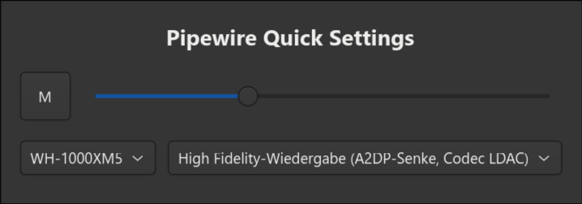

# Pipewire Quick Settings

Quick settings utility for PipeWire. Contains a command-line utility and a graphical interface.



This utility is dead simple on purpose, designed to be used as a quick switcher / volume control which can be started from e.g. your waybar.

It uses `pw-dump` and `wpctl` to interact with pipewire.

## Usage

Start the `main.py` file. Use `--mode` to either start in CLI or GUI mode.

```sh
# Start in CLI mode (standard)
./src/main.py

# Start in GUI mode
./src/main.py --mode gui
```
